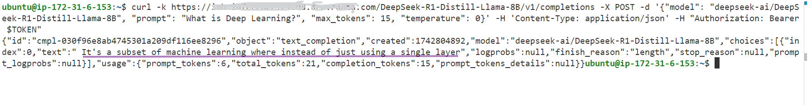

This documentation outlines various methods through which deployed Inference Models APIs can be accessed.   
While `curl` is the standard access method, you have the flexibility to utilize Postman with its collections and environment configurations. Additionally, the APIs are compatible with OpenAPI-style clients, such as Swagger UI, Open WebUI or any client that supports OpenAPI specifications, allowing you to choose the platform that best fits your preferences.


The access clients are summarized in the table. To quickly verify the models are accessible, follow the steps to access models with cURL. 
| Access Client | Description |
|---------------|-------------|
| [**cURL**](#accessing-models-from-curl-client) | A command-line tool that uses URL syntax to transfer data to and from servers. It is widely supported and considered a go-to method for quick API interactions. |
| [**Postman**](./postman-client-model-access.md) | An API platform for building and using APIs. Postman simplifies each step of the API lifecycle and streamlines collaboration so you can create better APIs faster. It offers a graphical interface and allows for easy management of API requests and responses. |


### Accessing Models from curl Client
To configure your environment with the necessary variables for connecting to Keycloak, you will need to set the following environment variables.  
Please replace the placeholder values with your actual configuration details, which has been configured in `inference-config.cfg` file under the `core/` directory during deployment.


#### Accessing Models Deployed with Keycloak and APISIX

##### Fetching the client Secret
For fetching the Keycloak client secret from please run this script  [**keycloak-fetch-client-secret.sh**](../core/scripts/keycloak-fetch-client-secret.sh)
`````
keycloak-fetch-client-secret.sh <cluster-url> <keycloak-username> <keycloak-password> <keycloak-client-id>
Returns:
Logged in successfully
Client secret: keycloak-client-secret
`````
Once you have the keycloak client secret, please refer below steps

`````
##### Environment Setup for accessing Models using Curl
                   
#The Keycloak cluster URL was configured during deployment in the cluster_url field
export BASE_URL=https://example.com            

#Default is 'master' if not changed
export KEYCLOAK_REALM=master

#The client ID can be found in the Keycloak console and was configured during deployment in the keycloak_client_id field
export KEYCLOAK_CLIENT_ID=<your_keycloak_client_id> 

#The client secret can be obtained from the Keycloak console under the 'Authorization' tab of the client ID
export KEYCLOAK_CLIENT_SECRET=<your_keycloak_client_secret> 

##### Obtaining the access token
export TOKEN=$(curl -k -X POST $BASE_URL/token  -H 'Content-Type: application/x-www-form-urlencoded' -d "grant_type=client_credentials&client_id=${KEYCLOAK_CLIENT_ID}&client_secret=${KEYCLOAK_CLIENT_SECRET}" | jq -r .access_token)

With the obtained access token, we can proceed to make an Inference API call to the deployed Models.
`````

##### Models Endpoints
`````
For Inferencing with Llama-3-8b:
curl -k ${BASE_URL}/Meta-Llama-3.1-8B-Instruct/v1/completions -X POST -d '{"model": "meta-llama/Meta-Llama-3.1-8B-Instruct", "prompt": "What is Deep Learning?", "max_tokens": 25, "temperature": 0}' -H 'Content-Type: application/json' -H "Authorization: Bearer $TOKEN"

For Inferencing with Llama-3-70b:
curl -k ${BASE_URL}/Meta-Llama-3.1-70B-Instruct/v1/completions -X POST -d '{"model": "meta-llama/Meta-Llama-3.1-70B-Instruct", "prompt": "What is Deep Learning?", "max_tokens": 25, "temperature": 0}' -H 'Content-Type: application/json' -H "Authorization: Bearer $TOKEN"

For Inferencing with Codellama-34b:
curl -k ${BASE_URL}/CodeLlama-34b-Instruct-hf/v1/completions -X POST -d '{"model": "codellama/CodeLlama-34b-Instruct-hf", "prompt": "What is Deep Learning?", "max_tokens": 25, "temperature": 0}' -H 'Content-Type: application/json' -H "Authorization: Bearer $TOKEN"

For Inferencing with Mistral-7b:
curl -k ${BASE_URL}/Mistral-7B-Instruct-v0.3/v1/completions -X POST -d '{"model": "mistralai/Mistral-7B-Instruct-v0.3", "prompt": "What is Deep Learning?", "max_tokens": 25, "temperature": 0}' -H 'Content-Type: application/json' -H "Authorization: Bearer $TOKEN"

For Inferencing with Mixtral-8x-7b:
curl -k ${BASE_URL}/Mixtral-8x7B-Instruct-v0.1/v1/completions -X POST -d '{"model": "mistralai/Mixtral-8x7B-Instruct-v0.1", "prompt": "What is Deep Learning?", "max_tokens": 25, "temperature": 0}' -H 'Content-Type: application/json' -H "Authorization: Bearer $TOKEN"

For Inferencing with Falcon3-7b:
curl -k ${BASE_URL}/Falcon3-7B-Instruct/v1/completions -X POST -d '{"model": "tiiuae/Falcon3-7B-Instruct", "prompt": "What is Deep Learning?", "max_tokens": 25, "temperature": 0}' -H 'Content-Type: application/json' -H "Authorization: Bearer $TOKEN"

For Inferencing with Tei:
curl -k ${BASE_URL}/bge-base-en-v1.5/v1/completions -X POST -d '{"model": "meta-llama/Meta-Llama-3.1-8B-Instruct", "prompt": "What is Deep Learning?", "max_tokens": 25, "temperature": 0}' -H 'Content-Type: application/json' -H "Authorization: Bearer $TOKEN"

For Inferencing with Tei-reranking:
curl -k ${BASE_URL}/bge-reranker-base/v1/completions -X POST -d '{"model": "meta-llama/Meta-Llama-3.1-8B-Instruct", "prompt": "What is Deep Learning?", "max_tokens": 25, "temperature": 0}' -H 'Content-Type: application/json' -H "Authorization: Bearer $TOKEN"

For Inferencing with Deepseek R1 Distill Qwen 32b:
curl -k ${BASE_URL}/DeepSeek-R1-Distill-Qwen-32B/v1/completions -X POST -d '{"model": "deepseek-ai/DeepSeek-R1-Distill-Qwen-32B", "prompt": "What is Deep Learning?", "max_tokens": 25, "temperature": 0}' -H 'Content-Type: application/json' -H "Authorization: Bearer $TOKEN"

For Inferencing with Deepseek R1 Distill Llama 8b:
curl -k ${BASE_URL}/DeepSeek-R1-Distill-Llama-8B/v1/completions -X POST -d '{"model": "deepseek-ai/DeepSeek-R1-Distill-Llama-8B", "prompt": "What is Deep Learning?", "max_tokens": 25, "temperature": 0}' -H 'Content-Type: application/json' -H "Authorization: Bearer $TOKEN"

For Inferencing with Llama-3-8b-CPU
curl -k ${BASE_URL}/Meta-Llama-3.1-8B-Instruct-vllmcpu/v1/completions -X POST -d '{"model": "meta-llama/Meta-Llama-3.1-8B-Instruct", "prompt": "What is Deep Learning?", "max_tokens": 25, "temperature": 0}' -H 'Content-Type: application/json' -H "Authorization: Bearer $TOKEN"

For Inferencing with Deepseek R1 Distill Qwen 32b CPU:
curl -k ${BASE_URL}/DeepSeek-R1-Distill-Qwen-32B-vllmcpu/v1/completions -X POST -d '{"model": "deepseek-ai/DeepSeek-R1-Distill-Qwen-32B", "prompt": "What is Deep Learning?", "max_tokens": 25, "temperature": 0}' -H 'Content-Type: application/json' -H "Authorization: Bearer $TOKEN"

For Inferencing with Deepseek R1 Distill Llama 8b CPU:
curl -k ${BASE_URL}/DeepSeek-R1-Distill-Llama-8B-vllmcpu/v1/completions -X POST -d '{"model": "deepseek-ai/DeepSeek-R1-Distill-Llama-8B", "prompt": "What is Deep Learning?", "max_tokens": 25, "temperature": 0}' -H 'Content-Type: application/json' -H "Authorization: Bearer $TOKEN"

`````

###### For visual assistance, refer to the following example image of a curl request and response:




#### Accessing the model from Inference Cluster deployed without APISIX and Keycloak
`````
When deploying models for inference without Keycloak and APISIX,
The model inference API can be invoked directly without the necessity of including an additional bearer token header in the request.

An exemplary structure for making a request to the inference API is as follows:

#The Keycloak cluster URL was configured during deployment in the cluster_url field
export BASE_URL=https://example.com

For Inferencing with Llama-3-8b:
curl -k ${BASE_URL}/Meta-Llama-3.1-8B-Instruct/v1/completions -X POST -d '{"model": "meta-llama/Meta-Llama-3.1-8B-Instruct", "prompt": "What is Deep Learning?", "max_tokens": 25, "temperature": 0}' -H 'Content-Type: application/json'

`````
