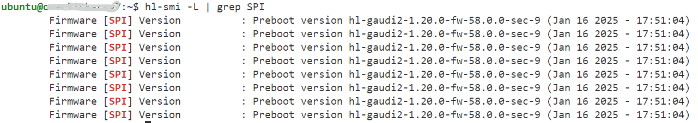
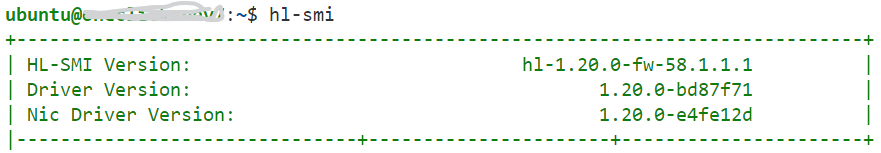

# Gaudi Node Requirements and Setup Guide

This guide helps verify and install the required firmware and driver version **1.20.0** for **Habana Gaudi** nodes in your Kubernetes or Standalone Environment.
   
#### Step 1: Verify Current Firmware Version
Use the following commands to check the firmware version installed on your Gaudi nodes:

```bash
hl-smi -L | grep SPI
```
Look for output similar to:
```
Firmware [SPI] Version : Preboot version hl-gaudi2-1.20.0-fw-58.0.0-sec-9 (Jan 16 2025 - 17:51:04)
```
###### For visual assistance, refer to the following snapshot for Firmware version:

   
   

#### Step 2: Verify Current Driver Version
Use the following commands to check the required driver version installed on your Gaudi nodes:

```bash
hl-smi 
```
Look for output similar to:
```
+-----------------------------------------------------------------------------+
| HL-SMI Version:                              hl-1.20.0-fw-58.1.1.1          |
| Driver Version:                                     1.20.0-bd87f71          |
| Nic Driver Version:                                 1.20.0-e4fe12d          |
|-------------------------------+----------------------+----------------------+
```
###### For visual assistance, refer to the following snapshot for Driver version:

    
   
#### Step 3: Verify Current Habana Runtime Version
Use the following commands to check the required Habana runtime version installed on your Gaudi nodes:

```bash
dpkg -l | grep habanalabs-container-runtime
```
Look for output similar to:
```
ii  habanalabs-container-runtime  1.20.0-543  HABANA container runtime
```

>  **If the Firmware, Driver, and Habana Runtime are all at version 1.20.0**, no further installation steps are required. You may proceed to the next section of your setup.  

>  **If any of the components are at a different version**, follow the steps below to uninstall and reinstall the correct version.

#### Installing Intel® Gaudi® Firmware Driver Runtime Software

#### Step 1: Unload Existing Drivers
```
echo "Unloading Habana drivers..."
sudo modprobe -r habanalabs && sudo modprobe -r habanalabs_cn
sudo modprobe -r habanalabs_ib && sudo modprobe -r habanalabs_en
```

#### Step 2: Clean Previous Installations (Optional)
```
echo "Removing old Habana runtime packages..."
sudo apt remove --purge -y habanalabs-container-runtime
sudo apt clean
```

#### Step 3: Install Required Packages
```
sudo apt update
echo "Installing Habana firmware and container runtime..."
sudo apt install -y habanalabs-firmware-odm
sudo apt install -y habanalabs-container-runtime
```

#### Step 4: Install or Upgrade Habana Base Installer
```
echo "Downloading Habana installer..."
wget -nv https://vault.habana.ai/artifactory/gaudi-installer/1.20.0/habanalabs-installer.sh
chmod +x habanalabs-installer.sh

# For Fresh Installation
./habanalabs-installer.sh install --type base

# For Upgrade Installation
./habanalabs-installer.sh upgrade --type base
```

#### Step 5: Update Firmware
```
echo "Updating firmware..."
sudo hl-fw-loader
```

#### Step 6: Load Habana Drivers
```
echo "loading habana drivers..."
sudo modprobe  habanalabs && sudo modprobe  habanalabs_cn
sudo modprobe  habanalabs_ib && sudo modprobe  habanalabs_en
```

Please follow above steps for verifying the installed firmware, driver and runtime versions.

kubectl get nodes
kubectl describe node node-name
```
Capacity:  
  habana.ai/gaudi:    8  
Allocatable: 
  habana.ai/gaudi:    8
```
Look for Capacity and Allocatable to be same, before deploying workloads

If you see any mismatch, please run below command
```
kubectl rollout restart ds habana-ai-device-plugin-ds -n habana-ai-operator
```
> **For detailed documentation, refer to the official guide:** [Intel® Gaudi® Software Installation Documentation](https://docs.habana.ai/en/v1.20.1/Installation_Guide/Driver_Installation.html)
>
> Note: It is recommended to reboot the device and verify the version of driver and firmware
> If for some reason rebooting the device is not possible, please try to restart habana device plugin as documented above if Model pods goes to pending due to workload nodes does not gets allocatable "habana.ai/gaudi" equal  to capacity as documented above.

