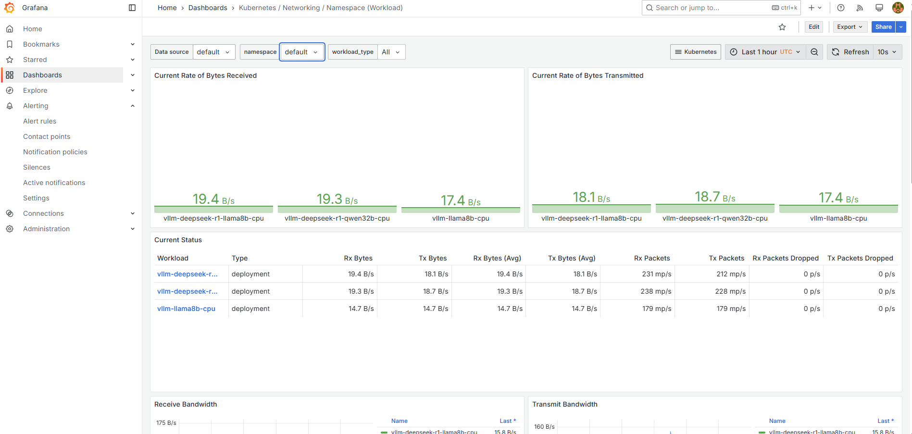
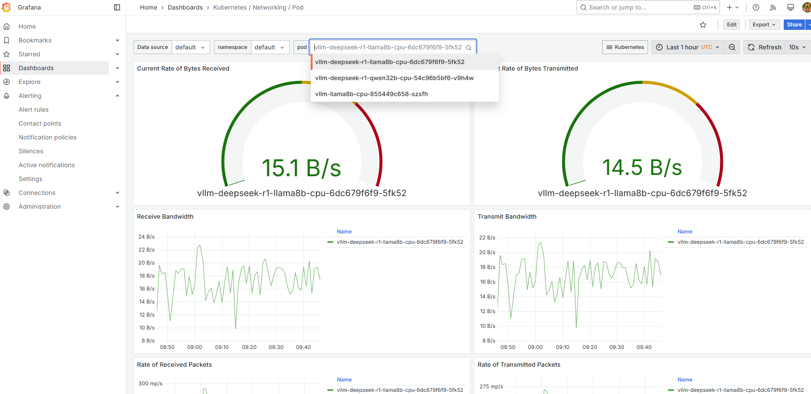
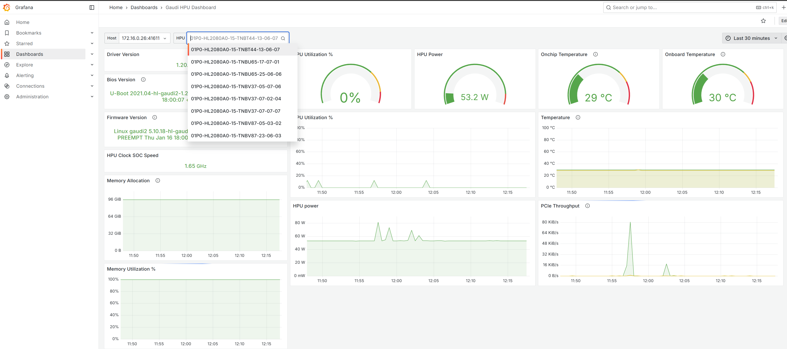
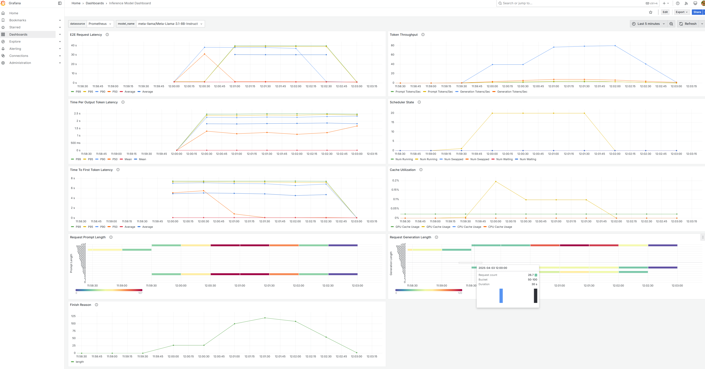
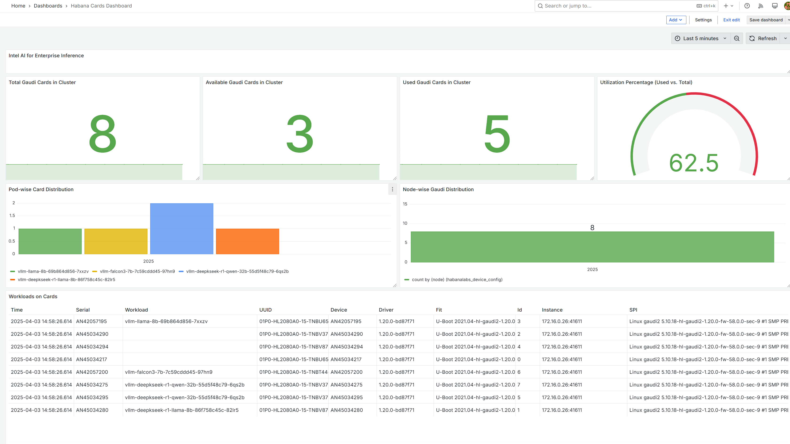

The observability stack offers monitoring solution designed to operate natively within Kubernetes clusters. 
###### It consists of the following key components:
- **Prometheus**: A time-series database and monitoring system that stores metrics from various sources, including Kubernetes components, applications, and custom exporters.
- **Alertmanager**: A component responsible for handling alerts generated by Prometheus based on predefined rules, enabling notifications and other procedures.
- **Grafana**: A powerful data visualization and dashboarding tool that integrates seamlessly with Prometheus, allowing users to create customized dashboards and visualizations for monitoring AI services and resources.

###### For visual assistance, refer to the following Cluster observability dashboard 





###### For visual assistance, refer to the following for Habana observability dashboard 



###### For visual assistance, refer to the following for Models observability dashboard 



###### For visual assistance, refer to the following for Cluster wide observability dashboard 



#### To access the observability dashboard, follow these steps:
Initiate your web browser and proceed to navigate to the specified URL:
```
   https://<cluster-url>/observability/login
   #The cluster URL was configured during deployment in the cluster_url field  in inference-config.cfg file)
   # Please use the default code "prom-operator" and kindly change it upon your first login.

```

Further API Documentation is coverd under docs/api-spec.yml

