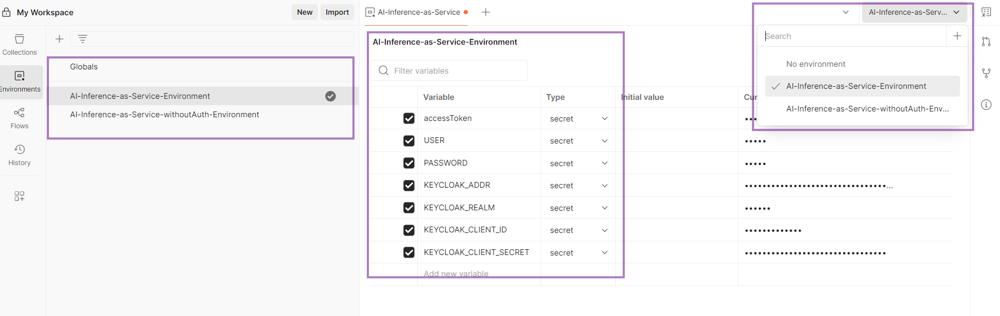

# Postman Client to Access Models 

## Prerequisites
- Ensure Postman is installed on the workstation.
- Obtain the Postman collection and environment files associated with the deployment.

## Setting Up Postman Environment
To interact with the inference model APIs through Postman, perform the following steps to configure the environment:
1. Launch Postman on the system.
2. Navigate to the 'Environment' tab located at the top right corner of the Postman interface.
3. Locate the Environment file located at `core/catalog/AI-Inference-as-Service-Environment.postman-environment.json`
4. Click on the 'import' button to import environment.
5. Populate the values for each variable according to the details provided in the `inference-config.cfg` file.

## Importing Postman Collection
Follow these instructions to import the Postman collection for the deployed models:
1. Select the 'Import' button within Postman.
2. Locate the collection file located at `core/catalog/AI-Inference-as-Service-postman-collection.json`.
3. Confirm the import to add the collection to the Postman workspace.

Refer to the screenshots below as reference for a Postman request setup:
### Postman Collection Request and Response

### Postman Service Environment

